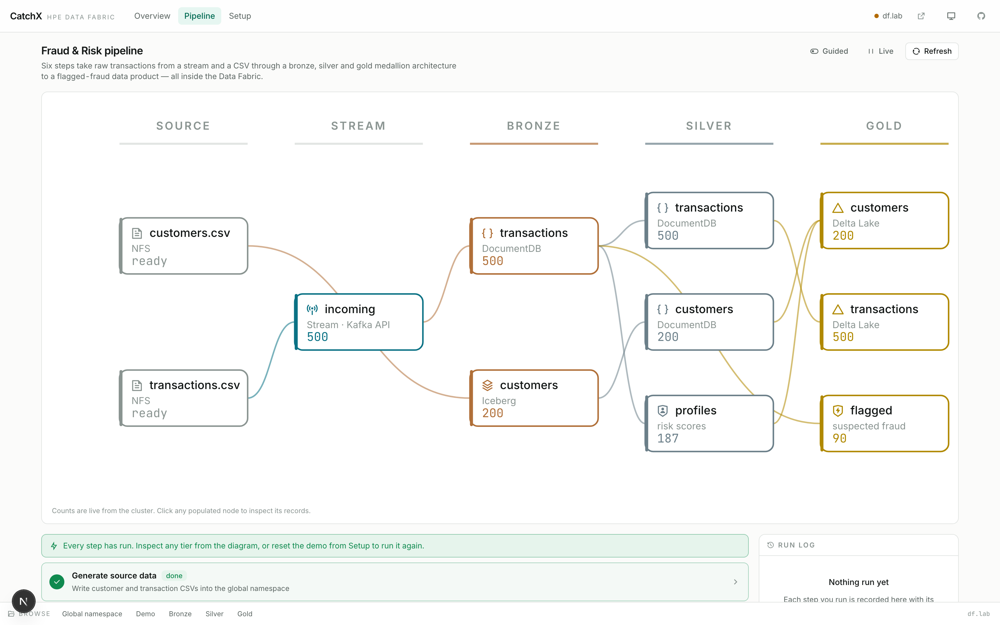
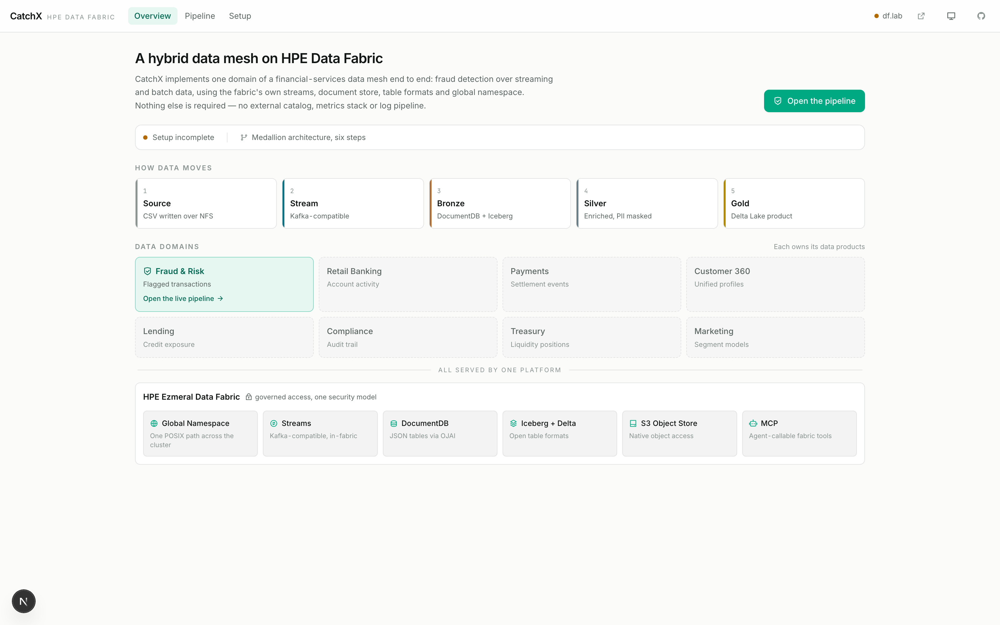
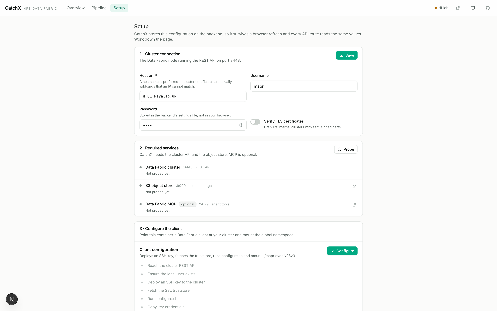
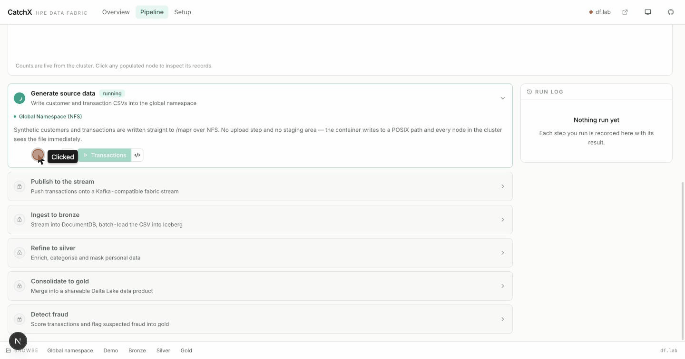
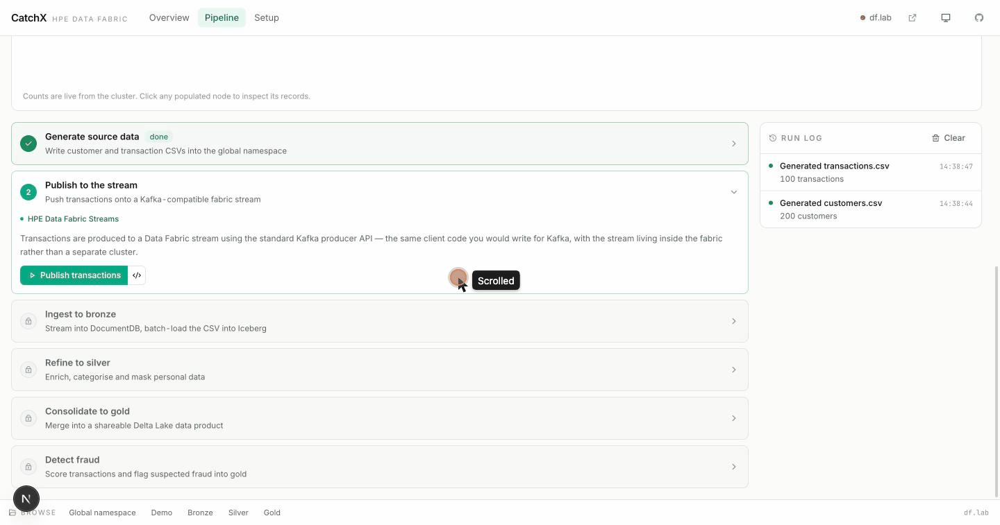
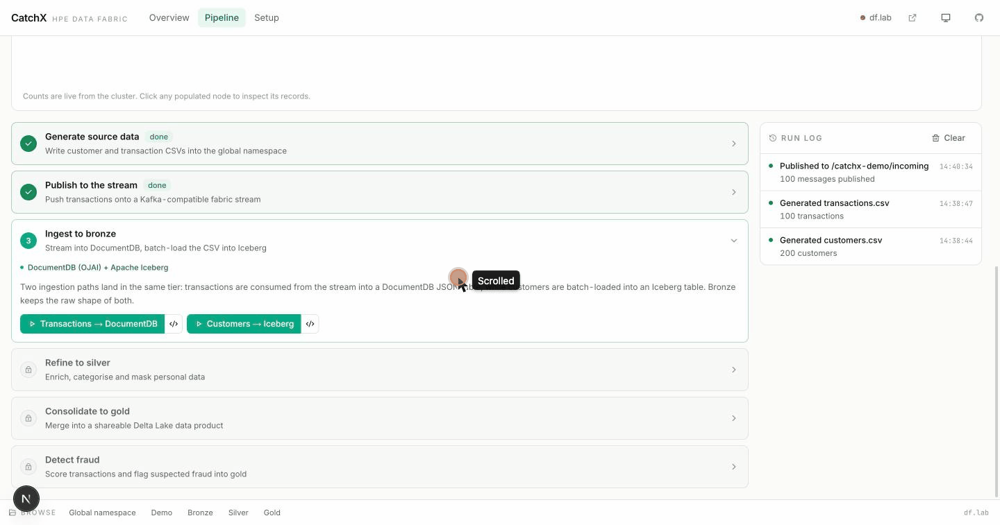
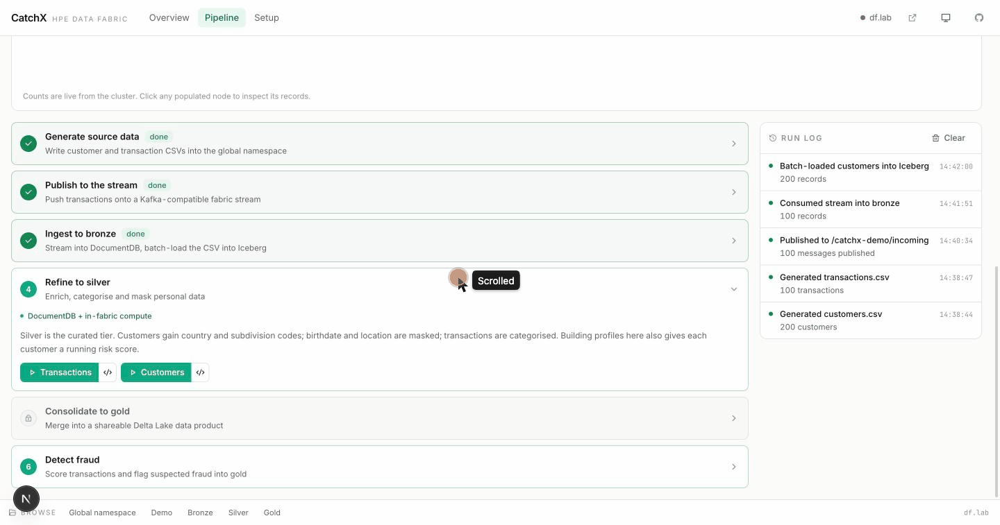
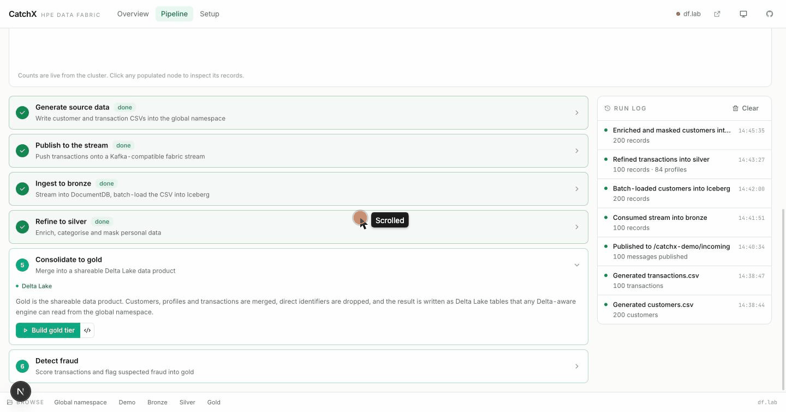
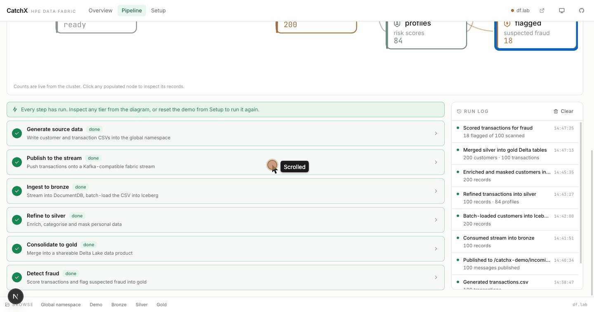
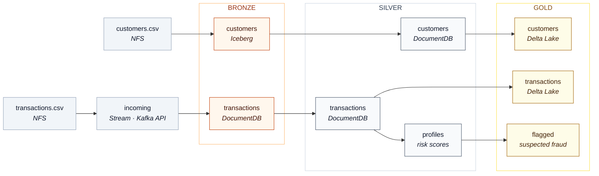

# CatchX — a fraud detection pipeline on HPE Data Fabric

An end-to-end demo of the HPE Data Fabric: transactions arrive on a
stream, customers arrive as a CSV, and both move through a bronze → silver →
gold medallion architecture into a shareable data product with suspected fraud
flagged.

Every step runs against a real cluster, and the app shows the actual code that
ran — including the standard Kafka, OJAI, Iceberg and Delta Lake calls
underneath.

This is not a real fraud model. The scoring is deliberately trivial: the point
is the data platform, not the algorithm. The tools were chosen for how simply
they demonstrate the fabric, not to constrain what you would use in production —
Data Fabric speaks standard protocols, so the same code works with your own
choice of engine.



<table>
<tr>
<td width="50%"></td>
<td width="50%"></td>
</tr>
<tr>
<td><em>Fraud &amp; Risk is one domain of a mesh; the platform underneath is shared.</em></td>
<td><em>Setup probes the cluster and reports what is missing, rather than failing later.</em></td>
</tr>
</table>

## What it demonstrates

| Capability | Where you see it |
|------------|------------------|
| Global Namespace (NFS) | Data written to `/mapr` as ordinary files; browse any tier from the app |
| Streams (Kafka API) | Transactions published and consumed with `confluent_kafka` |
| DocumentDB (OJAI) | Bronze and silver JSON tables |
| Apache Iceberg | Bronze customers, catalogued **inside the global namespace** |
| Delta Lake | Gold-tier data product, updated by merge |
| S3 object store | Access keys generated through the cluster API |
| Data Fabric MCP | Optional discovery of the fabric's agent-callable tools |

## Watch it run

Six clips, one capability each, recorded against a live cluster.

### One namespace, ordinary files

Generation writes straight to `/mapr` over NFS — no upload, no staging area. The
browser at the bottom of the page runs `ls` against the mount, so the same
`catchx-demo` directory shows CSV files, an Iceberg catalog, the tier volumes,
and streams and tables as `mapr::table::` entries alongside them.



### Streams, spoken as Kafka

Transactions are produced to a fabric stream with the standard Kafka producer.
The stream node picks up the count from the cluster's own REST API.



### Two ingestion paths, one tier

Transactions are consumed from the stream into a DocumentDB JSON table;
customers are batch-loaded into Iceberg. Both land in bronze, and both are read
back from the cluster.



### Enrichment and masking in the silver tier

Customers gain country and ISO 3166-2 subdivision codes; birthdate and location
come back **masked**. The same records were fully visible in bronze a moment
earlier — the tier boundary is where that changes.



### A shareable gold data product

Silver is merged into Delta Lake tables, then every transaction is scored and
the suspected ones are flagged in a single Delta merge. The flagged view carries
no account numbers — direct identifiers are dropped on the way into gold.



### The code that actually ran

Every step has a `</>` button. It shows the function that ran and follows the
call chain down to the fabric client itself — `confluent_kafka.Producer` for the
stream, `mapr.ojai.storage.ConnectionFactory` for DocumentDB. Nothing in the
path is bespoke.



## Prerequisites

### A Data Fabric cluster

You need a running HPE Data Fabric cluster (7.x or later) that this app
can reach. The demo creates and destroys its own tables, streams and files, so
**use a lab or demo cluster, not production.**

Required packages on the cluster:

```bash
mapr-kafka                 # streams
mapr-data-access-gateway   # DocumentDB / OJAI access on :5678
mapr-nfs                   # NFSv3 server for the global namespace
```

The object store (S3, port 9000) ships with the fabric and must be running.

### Cluster account

The app needs an account with **administrative rights**, because it creates and
deletes cluster artefacts on your behalf:

| It does this | Which needs |
|--------------|-------------|
| Creates 4 volumes under `/catchx-demo` | volume create / remove |
| Creates DocumentDB tables and streams | table and stream create / delete |
| Generates an S3 access key | S3 key generation |
| Runs `configure.sh` and mounts NFS | SSH access to a cluster node, and `sudo` on the client |
| Reads cluster and stream telemetry | REST API read on :8443 |

On an isolated demo cluster the simplest choice is the cluster admin (`mapr`)
user. Otherwise create a user with volume, table and stream management rights,
and SSH access to the node you point the app at.

### Ports the app must reach

| Service | Port | Required |
|---------|------|----------|
| Cluster REST API | 8443 | yes |
| Data Access Gateway (OJAI) | 5678 | yes |
| S3 object store | 9000 | yes |
| NFS | 2049 | yes |
| SSH | 22 | yes — for client configuration |
| Data Fabric MCP | 5679 | no |

Nothing else. Stream throughput and consumer lag come from the
cluster's own REST API, and the Iceberg catalog is a SQL catalog stored in the
global namespace.

The Setup page probes all of this and tells you what is missing, so you do not
have to verify it by hand first.

### Where the app runs

Docker with the Compose plugin. The backend container runs **privileged** — it
mounts the cluster's global namespace over NFS itself — so the host kernel needs
NFS support (`nfs` / `nfsd` modules available). Most Linux hosts have this;
Docker Desktop on macOS and Windows generally does not, so run it on a Linux
host or VM with network access to the cluster.

See [EXTRAS.md](./EXTRAS.md) for optional cluster extras.

## Run it

Pull the published images:

```bash
git clone https://github.com/erdincka/catchx
cd catchx
docker compose up -d
```

Or build them yourself:

```bash
docker compose up -d --build
```

The backend image is large (~5 GB) — it is built on the Data Fabric PACC base image,
which carries the full client stack. The first pull takes a while.

Open <http://localhost:3000> and work down the **Setup** page:

1. **Cluster connection** — host, username, password. Stored on the backend, so
   it survives a browser refresh.
2. **Required services** — probe the cluster and object store.
3. **Configure the client** — deploys an SSH key, fetches the truststore, runs
   `configure.sh`, and mounts `/mapr` over NFS.
4. **Provision** — creates the demo volumes, tables and streams.
5. **Object store access** — generates S3 keys through the cluster API.

Then open **Pipeline** and run the six steps.

Prefer a hostname over an IP address: Data Fabric clusters usually carry a wildcard
certificate that an IP can never match. The app detects this and works around it
for DocumentDB, but a hostname avoids the problem entirely.

Backend API docs: <http://localhost:8000/docs>.

## The pipeline



1. **Generate** — write customer and transaction CSVs into the global namespace
2. **Publish** — push transactions onto a fabric stream via the Kafka API
3. **Ingest** — stream into DocumentDB, batch-load the CSV into Iceberg
4. **Refine** — enrich, categorise, mask personal data, build risk profiles
5. **Consolidate** — merge into a Delta Lake data product
6. **Detect** — score transactions and flag suspected fraud

Steps unlock in order, and completion is read from the cluster rather than from
what you clicked — so a page reload, or someone else having run half the demo,
still shows the truth. **Expert** mode removes the ordering when you want to
jump straight to a particular step.

Click any populated node in the diagram to inspect its records, or the `</>`
button on a step to see the code that ran, including the fabric client calls it
makes.

## Resetting between runs

Everything lives under `/catchx-demo` on the cluster. **Delete demo data** on
the Setup page removes the streams, tables and generated files, and leaves the
four volumes in place — after which the demo runs again from step 4.

The volumes stay deliberately. Deleting a volume and recreating one at the same
path leaves the Data Access Gateway holding a stale reference to it, and every
DocumentDB call then fails with `err code = 19` ("No such device") until the
gateway is restarted. Dropping and recreating a *table* has no such effect, so
the reset works entirely at that level.

If you do remove the volumes — `DELETE /api/cluster/cleanup?remove_volumes=true`,
or by hand on the cluster — then restart the gateway before running the demo
again:

```bash
maprcli node services -name data-access-gateway -action restart -nodes <node>
```

## How long a run takes

Measured against a single-node Data Fabric 8.1.0 cluster, with the app on a
separate host 0.6 ms away:

| | UI defaults (200 customers, 100 transactions) | 500 transactions |
|---|---|---|
| Reset and provision | 27 s | 21 s |
| Generate and publish | 1 s | 1 s |
| Ingest to bronze | 19 s | 47 s |
| Refine to silver | 58 s | 86 s |
| Consolidate and detect | 8 s | 7 s |
| **Total** | **1 m 53 s** | **2 m 42 s** |

Almost all of it is DocumentDB writes, which cost roughly one round trip per
document; the app issues eight at a time to compensate. Everything else — the
stream, Iceberg, Delta — is fast enough not to notice. If a run is dramatically
slower than this, check that the Data Access Gateway is not logging at `debug`:
its default log4j2 configuration writes every gRPC frame and every document
payload to disk, which dominates the cost of each write.

## Deploying on Kubernetes

A Helm chart is in `helm/`, running the same two images
(`ghcr.io/erdincka/catchx-backend`, `ghcr.io/erdincka/catchx-frontend`) in one
pod. The backend
needs `SYS_ADMIN` for the NFS mount, and a volume mounted at `/app/data` if you
want settings to persist across restarts.

## Notes

- The backend container performs the NFS mount itself. Do not bind-mount the
  host's `/mapr` over it.
- Recreating the backend container drops the Data Fabric client configuration and the
  mount; re-run **Configure the client** afterwards.
- Generating customers appends, so running it repeatedly grows the dataset.
- Light and dark themes follow your system setting; the toggle in the header
  overrides it.

## Working on the code

See [CLAUDE.md](./CLAUDE.md) for architecture, conventions, and the constraints
worth knowing before changing anything.
